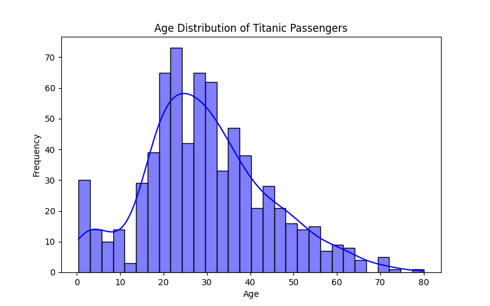
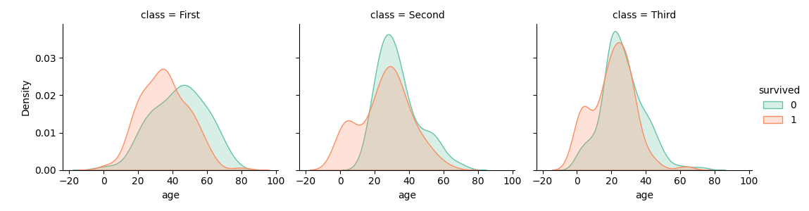
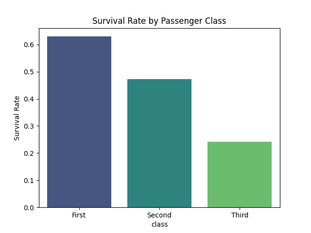
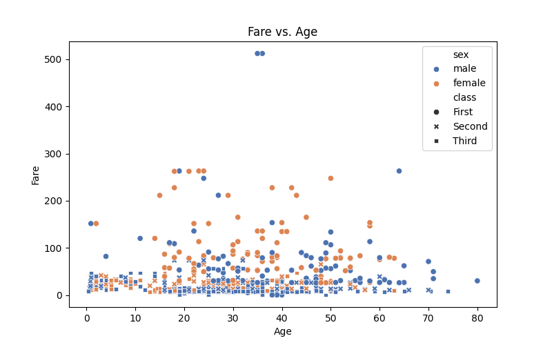
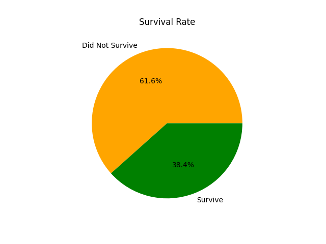

# Titanic Data Visualization Project

This project explores the Titanic dataset through a wide range of data visualization techniques using Python.
It covers:
- **Univariate Analysis** — Distribution of individual variables
  * Histogram – Age distribution
  * Countplot – Passenger class
  * Pie Chart – Survival rate
- **Bivariate Analysis** — Relationships between two variables
  * Boxplot – Age distribution across classes
  * Barplot – Survival rate by class
  * Scatterplot – Fare vs. Age  
- **Multivariate Analysis** — Correlation between multiple variables
  * Heatmap – Correlation matrix (after handling missing values)
  * Pairplots – Multiple variable relationships
- **Advanced Visualizations** — Violin plots, swarm plots and FacetGrids
  * Violin Plot – Age distribution by survival status
  * Swarmplot – Survival based on class and gender
  * FacetGrid – Age and class breakdown with survival overlay  
- **Categorical & Time-Based Analysis** — Class-wise and gender-based insights
  * Countplot – Gender vs survival
  * Lineplot – Simulated trend analysis with age
- **Customization & Styling** — Applied themes, annotations and visual polish to make graphs more presentable and insightful.


## Objective
The goal of this project is to perform **Exploratory Data Analysis (EDA)** on the Titanic dataset to discover key insights about **passenger survival patterns**, demographic trends and relationships between various features such as age, class, fare and gender.  

## Dataset

| Feature | Description |
|----------|-------------|
| `survived` | Survival (0 = No, 1 = Yes) |
| `pclass` | Passenger class (1 = Upper, 2 = Middle, 3 = Lower) |
| `sex` | Gender |
| `age` | Age of passenger |
| `sibsp` | Number of siblings/spouses aboard |
| `parch` | Number of parents/children aboard |
| `fare` | Passenger fare |
| `embarked` | Port of Embarkation (C = Cherbourg; Q = Queenstown; S = Southampton) |
| `class` | Passenger class (categorical) |
| `who`, `adult_male`, `deck`, `embark_town`, `alive`, `alone` | Additional derived columns |

📌 You can find the dataset on Kaggle Titanic - Machine Learning from Disaster

## Tools & Libraries Used
- **PyCharm IDE**
- **Python 3.x**
- **Pandas** — Data handling and cleaning  
- **Seaborn** — Data visualization and advanced plots (For high-level, attractive statistical visualizations)
- **Matplotlib** — Plot customization and styling (For base-level plotting and customization) 

## dataVisualization1.py

```Python
import matplotlib.pyplot as plt
import seaborn as sns


# Load Titanic dataset
titanic = sns.load_dataset('titanic')

# Display the first few rows
print(titanic.head())

# Summary of dataset
print(titanic.info())


### 2. Univariate Analysis (Single variable visualization)

# a.  Distribution of Numeric Data
# Visualize the age distribution of passengers.

plt.figure(figsize=(8,5))
sns.histplot(titanic['age'].dropna(), bins=30, kde=True, color='blue')
plt.title('Age Distribution of Titanic Passengers')
plt.xlabel('Age')
plt.ylabel('Frequency')
plt.show()

# b. Count Plot for Categorical Data
# Count Plot for passenger class.

sns.countplot(data=titanic, x='class', palette='viridis')
plt.title('Passenger Class Distribution')
plt.show()

# c. Pie Chart
# Survival rate representation.

titanic['survived'].value_counts().plot(kind='pie',
        labels=['Did Not Survive', 'Survive'], autopct='%1.1f%%',  colors=['Orange','green'])
plt.title('Survival Rate')
plt.ylabel('')
plt.show()

### 3. Bivariate Analysis (Relationships Between Two Variables)

# a. Boxplot
# Compare age distribution across passenger Classes.

plt.figure(figsize=(8, 5))
sns.boxplot(data=titanic, x='class', y='age', palette='coolwarm')
plt.title('Age Distribution Across Passenger Classes')
plt.show()

# Barplot
# Survival rate by passenger class.

sns.barplot(data=titanic, x='class', y='survived', ci=None, palette='viridis')
plt.title('Survival Rate by Passenger Class')
plt.ylabel('Survival Rate')
plt.show()

# Scatterplot
# Fare vs. Age

plt.figure(figsize=(8, 5))
sns.scatterplot(data=titanic, x='age', y='fare', hue='sex', style='class', palette='deep')
plt.title('Fare vs. Age')
plt.xlabel('Age')
plt.ylabel('Fare')
plt.show()

### 4. Multivariate Analysis
#a Heatmap
# Correlation matrix for numeric variables.
# Heatmap missing values: Fill missing numeric values with the Mean
numeric_data = titanic.select_dtypes(include='number').copy()
numeric_data = numeric_data.fillna(numeric_data.mean()) #imputation techniques
plt.figure(figsize=(10, 8))
sns.heatmap(numeric_data.corr(), annot=True, cmap='coolwarm', fmt=".2f", linewidths=0.5)
plt.title('Correlation Matrix')
plt.show()

# Handle missing values in selected columns for the pairplots
pairplots_data = titanic[['age','fare','pclass','survived']].dropna()

# b. Pairplots
# Visualization multiple relationships.
sns.pairplot(titanic[['age','fare', 'pclass', 'survived']], hue='survived', palette='husl')
plt.suptitle('Pairplots of Titanic Dataset', y=1.02)
plt.show()

### 5. Advanced Visualizations

# a. Violin Plot
# Distribution of age by survival status.

sns.violinplot(data=titanic, x='survived', y='age', split=True, hue='sex', palette='muted')
plt.title('Age Distribution by Survival Status and Gender')
plt.show()

# b. Swarmplot
# Survival by class and gender.

sns.swarmplot(data=titanic, x='class', y='age', hue='survived', palette='Set1', dodge=True)
plt.title('Age Distribution by Class and Survival')
plt.show()

# c. FaceGrid
# Survival rates across age for each class.

g = sns.FacetGrid(titanic, col='class', hue='survived', aspect=1.2, palette='Set2')
g.map(sns.kdeplot, 'age', fill=True)
g.add_legend()
plt.show()

# Advanced plot to uncover complex relationships.
# FaceGrid for breaking data into smaller groups.

### 6. Categorical and Time-Based Analysis
# a) Countplot with Gender and Survival
# Survival comparison by gender.

sns.countplot(data=titanic, x='sex', hue='survived', palette='pastel')
plt.title('Survival by Gender')
plt.show()

# b. Lineplot (If Time Data Available)
# simulating passenger age trends.

sns.lineplot(data=titanic.sort_values(by='age'), x='age', y='fare', hue='class', palette='coolwarm')
plt.title('Fare vs Trends by Class')
plt.show()

### 7. Customizing Visuals for Better Presentation
# Add annotations and themes for polished visuals.

sns.set_theme(style='whitegrid')
plt.figure(figsize=(8, 5))
sns.barplot(data=titanic, x='embark_town', y='fare', ci=None, hue='class', palette='cool')
plt.title('Fare Paid by Embarkation Town and Class')
plt.xlabel('Embarkation Town')
plt.ylabel('Fare')
plt.legend(title='Class')
plt.show()
```
## Console Result

RangeIndex: 891 entries, 0 to 890
Data columns (total 15 columns):
| Column | Non-Null | Count | Dtype |
|----------|-------------|------------|------------|
| 0   | survived |    891 non-null |   int64   |
| 1  | pclass    |   891 non-null |   int64   |
| 2  | sex       |   891 non-null |   object  |
| 3   |age       |   714 non-null |   float64 |
| 4  | sibsp     |   891 non-null|    int64   |
| 5  | parch    |    891 non-null |   int64   |
| 6 |  fare   |      891 non-null |   float64 |
| 7 |  embarked |    889 non-null |   object  |
| 8 |  class    |    891 non-null |   category|
| 9 |  who      |    891 non-null |   object  |
| 10|  adult_male |  891 non-null |   bool    |
| 11|  deck      |   203 non-null |   category|
| 12 | embark_town|  889 non-null|    object | 
| 13 | alive     |   891 non-null |   object | 
| 14  |alone    |    891 non-null|    bool   |

dtypes: bool(2), category(2), float64(2), int64(4), object(5)
memory usage: 80.7+ KB
None

## Graphs
.png)
.png)
.png)

.png)
.png)

.png)




.png)


📂 Project Structure
├── titanic_visualization.ipynb   # Main project notebook
├── titanic.csv                   # Dataset file
├── README.md                     # Project overview
└── /images (Figures)             # Folder containing exported plots

## Connect with Me 🤝
If you found this project interesting, let’s connect!  

[](https://www.linkedin.com/in/sunil-prajapati832) 
